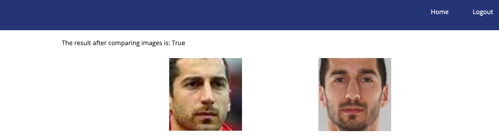

# Face-similarity-recognition
Using ML algorithms, this web app will verify if the 2 photos belong to the same person by giving True or False values.

You can:
* Sign in/Sign up into your account
* Compare 2 images and see if they belong to the same person


## DEMO
<p align="center">
  
  
</p>

## RESULT - Uploading Henrikh MKhitaryan's 2 different photos
<p align="center">
  
</p>


## Clone this repository

```bash
> git clone https://github.com/anahitxachatryan/Face-similarity-recognition.git
```

## Commands

To run this web app

```bash
> python main.py
```


